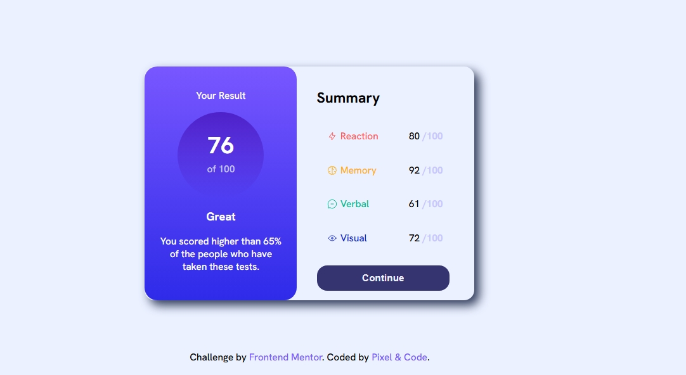

# Frontend Mentor - Results summary component solution

This is a solution to the [Results summary component challenge on Frontend Mentor](https://www.frontendmentor.io/challenges/results-summary-component-CE_K6s0maV). Frontend Mentor challenges help you improve your coding skills by building realistic projects. 

## Table of contents

- [Overview](#overview)
  - [The challenge](#the-challenge)
  - [Screenshot](#screenshot)
  - [Links](#links)
- [My process](#my-process)
  - [Built with](#built-with)
  - [What I learned](#what-i-learned)
  - [Continued development](#continued-development)
  - [Useful resources](#useful-resources)
- [Author](#author)
- [Acknowledgments](#acknowledgments)

**Note: Delete this note and update the table of contents based on what sections you keep.**

## Overview
This project is a Results Summary Component, inspired by a Frontend Mentor challenge. The component displays a user's test score summary, dynamically rendered from a JSON data file.

The layout is clean and modern, with a gradient-based score section and a summary table that visually highlights different categories using distinct colors.

### The challenge

1️⃣ Rendering JSON data dynamically to the table
The challenge was fetching and iterating through JSON data, then injecting it as table rows into the DOM.

2️⃣ Applying different colors to each category dynamically
Solved by using conditional logic in JavaScript to assign inline colors directly based on the category value.

### Screenshot



### Links

- Solution URL: [Add solution URL here](https://github.com/jeff20501/resultify)
- Live Site URL: [Add live site URL here](https://resultifypage.netlify.app/)

## My process

### Built with

HTML5: Markup structure

CSS3: Styling (gradients, flexbox, responsive design, custom fonts)

JavaScript (ES6+): DOM manipulation, dynamic rendering of data

JSON: Data source for categories and scores

Google Fonts: Custom fonts (Hanken Grotesk, Poppins)

### What I learned

Use this section to recap over some of your major learnings while working through this project. Writing these out and providing code samples of areas you want to highlight is a great way to reinforce your own knowledge.

To see how you can add code snippets, see below:

```html
<h1>Some HTML code I'm proud of</h1>
```
```css
.proud-of-this-css {
  color: papayawhip;
}
```
```js
const proudOfThisFunc = () => {
  console.log('🎉')
}
```

If you want more help with writing markdown, we'd recommend checking out [The Markdown Guide](https://www.markdownguide.org/) to learn more.

**Note: Delete this note and the content within this section and replace with your own learnings.**

### Continued development

Add form submission to collect actual user data and calculate real-time results

Integrate a backend API to store or retrieve scores

Add animations or transitions on score load

Improve accessibility (ARIA labels, keyboard navigation)

Implement tests (unit or UI) to ensure reliability

### Useful resources
- [YouTube  How to Insert an Image in HTML Table](https://www.youtube.com/watch?v=6Kq3QZGdr7s) - helped align and size the images properly

- [StackOverflow - Adding space between](https://stackoverflow.com/questions/2070817/add-space-between-cells-td-using-css) -  ```<td>``` cells — used for border-spacing in table styling

- [W3Schools - CSS Gradients](https://www.w3schools.com/css/css3_gradients.asp) — used to create modern gradient backgrounds for score and button hover states

- [Learn JSON files in 10 minutes! 📄](https://www.youtube.com/watch?v=r4MLHHLctKw) and [Read JSON File into HTML with JavaScript Fetch API](https://www.youtube.com/watch?v=Oage6H4GX2o) — helped understand how to dynamically add elements to the DOM

## Author

- Frontend Mentor - [@jeff20501](https://www.frontendmentor.io/profile/jeff20501)
- github - [@jeff20501](https://github.com/jeff20501)

